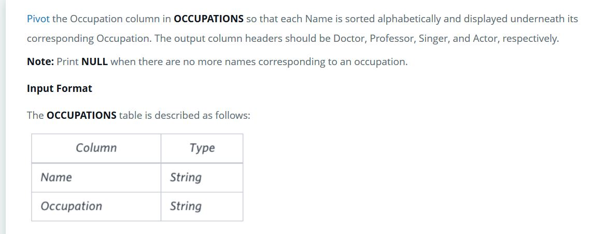
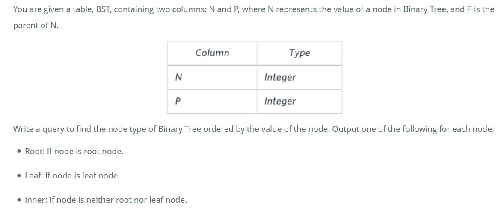
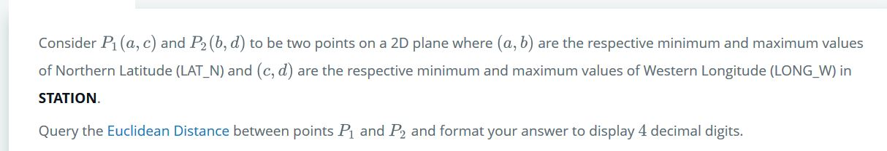
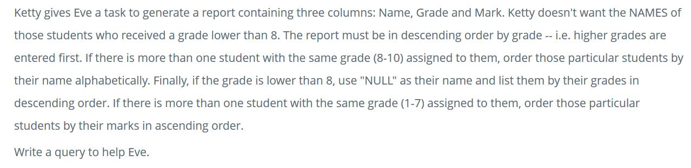
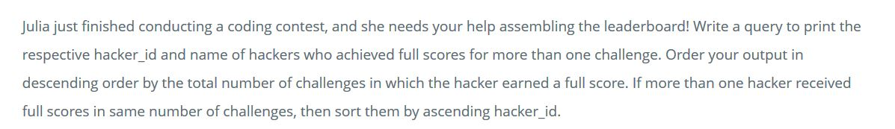

<h1>SQL Examples</h1>

<h2>PIVOT </h2>

<h3>Question</h3>
 

<h3>Answer</h3>

      SELECT Doctor, Professor, Singer, Actor  
      FROM 
      (SELECT name, occupation, ROW_NUMBER() OVER (PARTITION BY occupation ORDER BY name)as rn FROM OCCUPATIONS )
      PIVOT
      ( MAX(name) FOR occupation  IN ('Doctor' as Doctor ,'Professor' as Professor ,'Singer' as Singer ,'Actor' as Actor)) 
      ORDER BY rn ;

<h3>Breakdown</h3>
This SQL Select Query is divided into three sections.

  1) The first SELECT Query selects the columns from the new pivot table that was created
  2) The second SELECT Query creates a new Table from the OCCUAPTION Table. This table contains the name and occupation as well as the row number. The rows will be counted based on the occupation field.
  3) The last section pivots the table. This has aggregated the name field despite not being needed. Additionally, it has created the columns that have been called in the first SELECT Query.

<h2>Case </h2>

<h3>Question</h3>

<h3>Answer</h3>

      SELECT N,
      CASE 
          WHEN P IS NULL THEN 'Root'
          WHEN N IN (SELECT P FROM BST) THEN 'Inner'
          ELSE 'Leaf'
      END
      FROM BST
      ORDER BY N ASC;

<h3>Breakdown</h3>

Using the CASE function we can add a value into the result depending on a value that was retrieved from the SELECT Query. In the above answer, the CASE statement looks at the value in P and if that value is NULL, Root will be outputted. If the value of N is in the P table, it outputs Inner. Otherwise, it will output Leaf.

<h2>Using POWER/ SQRT for Math Equations</h2>

<h3>Question</h3>

<h3> Answer</h3> 

      SELECT ROUND(SQRT(POWER((a - b),2) + POWER((c - d),2)),4) 
      FROM 
      (SELECT MIN(LAT_N) AS a,MAX(LAT_N) AS b ,MIN(LONG_W) AS c ,MAX(LONG_W) AS d FROM STATION);
      
<h3> Breakdown</h3>

The first SELECT Query uses the aggregated values from the results of the second query to calculate the Euclidean Distance.

<h2>Join with CASE </h2>

<h3>Question</h3>

 

<h3> Answer</h3>

      SELECT 
      CASE 
          WHEN grade < 8 THEN 'NULL'
          ELSE name
      END AS name
      ,GRADES.grade,STUDENTS.marks
      FROM STUDENTS
      JOIN GRADES ON STUDENTS.marks BETWEEN GRADES.min_mark AND GRADES.max_mark
      ORDER BY GRADES.grade DESC , name ASC , STUDENTS.marks ASC;

<h3>Breakdown </h3>

This Query is divided up into two parts

   Case - This checks if the grade is lower then 8 and return NULL or the NAME of the student depending on the answer
   Join - This does a join action depending on whether the student's mark on the grade boundaries. The correct grade value is then added onto the table.

<h2>Join with Having </h2>

<h3>Questioins</h3>

 

<h3>Answer</h3>

      SELECT HACKERS.hacker_id, HACKERS.name 
      FROM HACKERS 
      INNER JOIN SUBMISSIONS ON HACKERS.hacker_id = SUBMISSIONS.hacker_id
      INNER JOIN DIFFICULTY ON SUBMISSIONS.score = DIFFICULTY.score 
      INNER JOIN CHALLENGES ON SUBMISSIONS.challenge_id = CHALLENGES.challenge_id AND DIFFICULTY.difficulty_level =           CHALLENGES.difficulty_level
      GROUP BY HACKERS.hacker_id, HACKERS.name HAVING COUNT(DISTINCT SUBMISSIONS.submission_id )> 1
      ORDER BY COUNT(DISTINCT SUBMISSIONS.submission_id ) DESC, hacker_id ASC;

<h3>Breakdown</h3>

The Query above selects the hacker_id and name of the hackers that have a full score in more than one challenge. This is done by joining the 4 tables together. However, the second join only selects the records that have the max score, so removing any records that are not full marks. The HAVING condition in the group by creates a condition for the grouping, so removing the record of any hacker that did not have full marks in more than one submission.

<h2>Join with OVER </h2>

<h2>Question</h2>

<h2>Answer</h2>

      SELECT id , age , min_coins,power 
      FROM
      (SELECT WANDS.id, WANDS_PROPERTY.age, WANDS.coins_needed, WANDS.power , MIN(WANDS.coins_needed) OVER (PARTITION BY WANDS_PROPERTY.code,WANDS_PROPERTY.age,WANDS.power) AS min_coins 
      FROM WANDS 
      INNER JOIN WANDS_PROPERTY ON WANDS.code = WANDS_PROPERTY.code 
      WHERE WANDS_PROPERTY.is_evil = 0) 
      WHERE coins_needed = min_coins 
      ORDER BY power DESC, age DESC;
      
 <h3>Breakdown</h3>
 
This SELECT Query uses a subquery with the over method to add the min coins needed for the wands with the same age and power. The main Query was then able to extract the essential information needed and place it in the required order.
